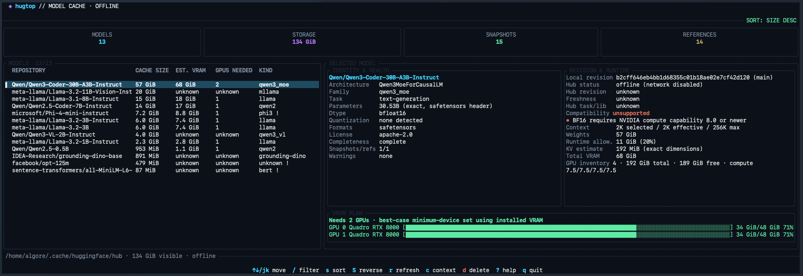

# hugtop

`hugtop` is a Rust terminal dashboard for inspecting Hugging Face models that
are already present in the local Hub cache. It combines cache inventory,
local model intelligence, context-aware VRAM planning, NVIDIA GPU fit
estimates, and optional Hub enrichment in a responsive Ratatui interface.



## Highlights

- Offline by default: scans local files without downloading models or
  contacting the Hugging Face Hub
- Sortable and filterable model inventory with cache size, estimated runtime
  VRAM, GPU count, and model family/task
- Local architecture, family, task, license, maximum context, dtype,
  quantization, weight formats, revision, and parameter count
- Parameter provenance and confidence, distinguishing exact SafeTensors-header
  counts from values reported by SafeTensors metadata, config fields, or model
  card front matter
- Cache completeness checks and warnings for missing referenced files,
  incomplete or locked artifacts, incomplete shard sets, malformed/oversized
  metadata, multiple snapshots, and duplicate references to one snapshot
- Selectable context presets and a KV-cache-aware VRAM component breakdown
- Runtime compatibility status with concrete reasons, GPU compute capability,
  format/backend caveats, and remote-code warnings
- Minimum-device, balanced per-GPU VRAM allocation using detected NVIDIA GPUs
- Optional, explicit `--online` Hub metadata and revision comparison

## Build, install, and run

Prerequisites are a stable Rust toolchain, a color terminal with
alternate-screen support, and at least one locally cached model.

```sh
# Development build
cargo build

# Optimized build
cargo build --release

# Install from this checkout
cargo install --path .

# Local-only dashboard (default)
hugtop

# Inspect a specific Hub cache
hugtop --cache-dir /mnt/models/hub

# Explicitly enable Hub enrichment
hugtop --online
```

## What the dashboard shows

The model table is size-descending by default. It separates physical cache
storage from the selected snapshot's recognized model-weight size and from the
context-dependent runtime VRAM estimate. Wide layouts also show a compact
family/task kind and warning marker.

The selected-model inspector is one unified view with no hidden pages or
modes. It shows identity, architecture/family, task, parameter count and
provenance, dtype, quantization, formats, license, cache completeness,
important warnings, local and latest Hub revisions, freshness, online state,
runtime compatibility and reasons, selected/model-maximum context, weights,
the 20% runtime allowance, KV-cache estimate and confidence, total VRAM, and
the minimum-GPU allocation plan together.

Wide terminals arrange metadata/health and revision/runtime in adjacent
sections with per-GPU bars directly below. Stacked terminals retain the same
categories and bars. Very small or short terminals use explicit
identity/health/runtime/GPU summaries rather than requiring navigation to
discover hidden content.

### Local model intelligence

`hugtop` reads bounded local metadata from the selected snapshot. Architecture,
model type/family, transformer dimensions, context limit, task, license,
dtype, and quantization primarily come from `config.json`; task, license, and
reported parameter count can fall back to model-card front matter.
SafeTensors headers can provide an exact tensor parameter count and dtype.
Recognized formats are SafeTensors, PyTorch, GGUF, ONNX, TensorFlow, and Flax.

Snapshot selection favors referenced snapshots and then recency. The displayed
local revision is the selected snapshot commit plus up to three refs. Multiple
snapshots and multiple refs resolving to the same commit are called out rather
than silently treated as one unambiguous revision.

Completeness is `complete`, `partial / incomplete`, or `unknown`. Partial
weights are treated as unsupported by the runtime assessment. Metadata and
warning values may be unknown when local files are absent, malformed, too
large for the bounded parser, unreadable, or use an unrecognized layout.

## Context and VRAM planning

The initial context is 2K tokens. Press `c` to cycle through
2K, 4K, 8K, 16K, 32K, and the model's reported maximum. Presets above a known
model maximum are omitted; the maximum itself is included, even when it is not
one of the standard values. The cycle wraps around. If the current selection
requests more than the model maximum, the inspector shows the effective
context as capped.

For supported decoder/text-generation models, the estimate is:

1. recognized local weight bytes;
2. a 20% runtime allowance applied once to the weight bytes (rounded up to a
   whole byte);
3. a batch-size-one KV cache based on effective context, layers, KV heads,
   head dimension, and KV dtype;
4. the sum used for GPU planning.

When KV heads are missing, attention heads are used as an MHA fallback; when
head dimension is missing, it may be derived from hidden size and attention
heads. The UI labels exact versus estimated dimensions. If the task/
architecture is not suitable for this decoder formula, required dimensions or
KV dtype are absent, or weights are unavailable, KV and total VRAM remain
unknown instead of presenting a misleading number.

### GPU allocation and compatibility

`hugtop` calls `nvidia-smi` to discover NVIDIA GPU name, total VRAM, current
free VRAM, and compute capability. It chooses the smallest fitting device set;
among equally sized sets it prefers the least unused installed capacity, then
balances the requirement across selected GPUs without exceeding a device's
capacity. Each bar shows that GPU's assigned share against total installed
VRAM. Current free memory is checked separately and warns when it is below the
assigned share; it does not change the installed-capacity plan.

Fit states distinguish allocated, no GPU, insufficient aggregate installed
VRAM, and unknown GPU detection. Runtime compatibility is separately reported
as `compatible`, `likely compatible`, `warning`, `unsupported`, or `unknown`,
with reasons such as:

- incomplete or unrecognized weights;
- GGUF requiring a llama.cpp-style runtime rather than generic CUDA loading;
- GPTQ/AWQ or other quantization requiring explicit backend/runtime support;
- configuration referencing remote custom code;
- unknown architecture or task-specific runtime needs;
- no detected NVIDIA accelerator or unavailable GPU capability data;
- BF16 requiring NVIDIA compute capability 8.0 or newer for this assessment.

These statuses describe the locally visible artifacts and detected NVIDIA
environment; they do not prove that a particular framework, kernel, driver,
CPU backend, or distributed runtime can load or execute the model.

> **Planning estimates, not guarantees:** VRAM calculations assume batch size
> one for the KV-cache formula. Activations, temporary buffers, allocator
> fragmentation, framework/kernel overhead, KV-cache representation, batching,
> parallelism, and runtime behavior can materially change actual use. GPU
> selection uses total installed VRAM, not current free VRAM. Format,
> quantization, backend, driver, and runtime support still matter. Missing or
> ambiguous metadata can make an estimate incomplete or unavailable.

## Offline and online behavior

Offline mode is the default:

```sh
hugtop
```

It makes no Hub requests. Enable network enrichment explicitly:

```sh
hugtop --online
```

Online mode queues one API request per discovered repository on a single
background worker, so local scanning and UI interaction continue while the
header/footer report progress. Refreshing the cache starts a new enrichment
generation and stale results are ignored.

Requests go over HTTPS to `huggingface.co/api/models/<repository>`. The client
uses a 5-second connect timeout, 10-second response and body timeouts, a
20-second global timeout, and a 2 MiB response limit. Authentication-required,
access-denied, missing, rate-limited, HTTP, timeout, oversized-response,
network, and invalid-response failures appear in the unified inspector without
discarding local metadata.

The response parser reads the repository ID, latest commit SHA, last-modified
time, pipeline task, library, tags, license, gated/private/disabled/deprecated
flags, although the dashboard does not display the tags. Revision status
is `up to date` for equal commit IDs or a matching abbreviated local commit,
`outdated` for different commit-like IDs, and `unknown` when either side is
missing or not a comparable commit ID.

Online mode reveals each local repository ID to Hugging Face and exposes the
usual network metadata (for example, source IP) to the service and network
path. The application does not read Hugging Face token environment variables
and its dashboard requests are unauthenticated; private or gated repositories
may therefore return an access/authentication error. It does not download
weights and does not display live benchmarks, download counts, likes, or other
popularity metadata.

## Cache discovery

Unless `--cache-dir` is supplied, the first non-empty configured location is
used in this order:

1. `HF_HUB_CACHE`
2. `$HF_HOME/hub`
3. `$XDG_CACHE_HOME/huggingface/hub`
4. `~/.cache/huggingface/hub`

```sh
HF_HUB_CACHE=/mnt/models/hub hugtop
HF_HOME="$HOME/.local/share/huggingface" hugtop
```

## Keyboard controls

| Key | Action |
| --- | --- |
| `Up` / `k`, `Down` / `j` | Move through models |
| `PageUp` / `PageDown` | Move one page |
| `Home` / `End` | Jump to the first/last visible model |
| `c` | Cycle context presets and the selected model maximum |
| `/` | Edit the model filter |
| `Enter` | Apply the filter |
| `Esc` | Cancel filter editing, or clear an applied filter |
| `s` / `S` | Cycle sort field / reverse sort direction |
| `r` | Rescan the cache, GPUs, local metadata, and online enrichment |
| `d` | Ask to delete the selected cached model |
| `?` | Toggle help |
| `q` or `Ctrl-C` | Quit |

Deletion is permanent and does not use Trash. After `d`, only `Y` or `y`
confirms; every other key cancels. During the confirmation prompt, navigation,
context cycling, refresh, quit, and other actions are not performed.
Successful deletion removes the selected model's cache directory and refreshes
the inventory. A failed deletion reports that the directory may be partially
removed.

## Development

```sh
cargo test
cargo fmt --all -- --check
```

Run `cargo fmt --all` to apply Rust formatting.

## License

MIT. See [LICENSE](LICENSE).
